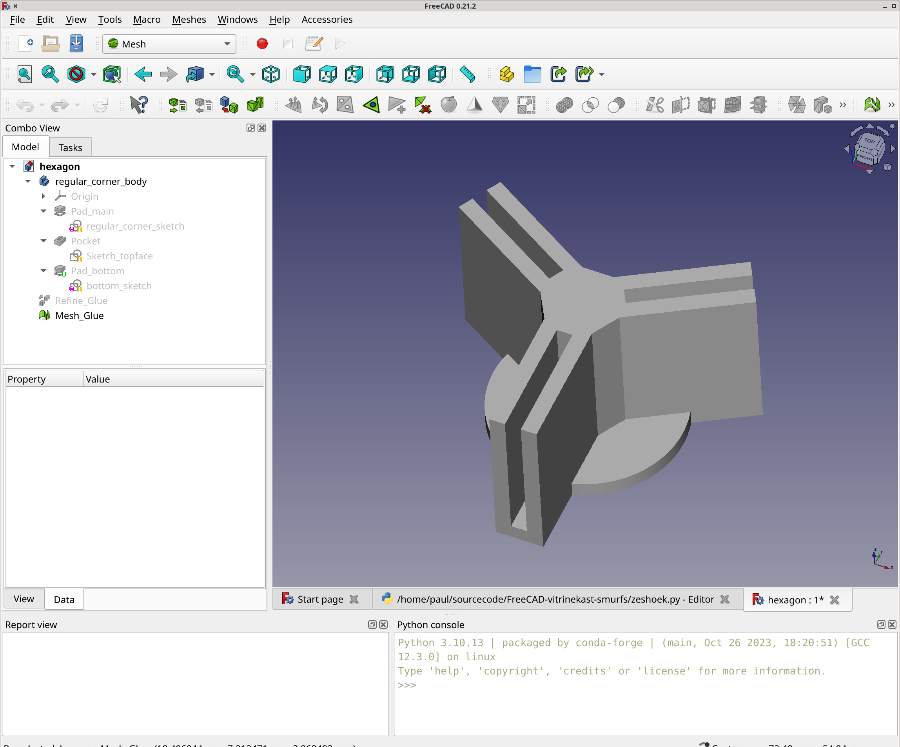
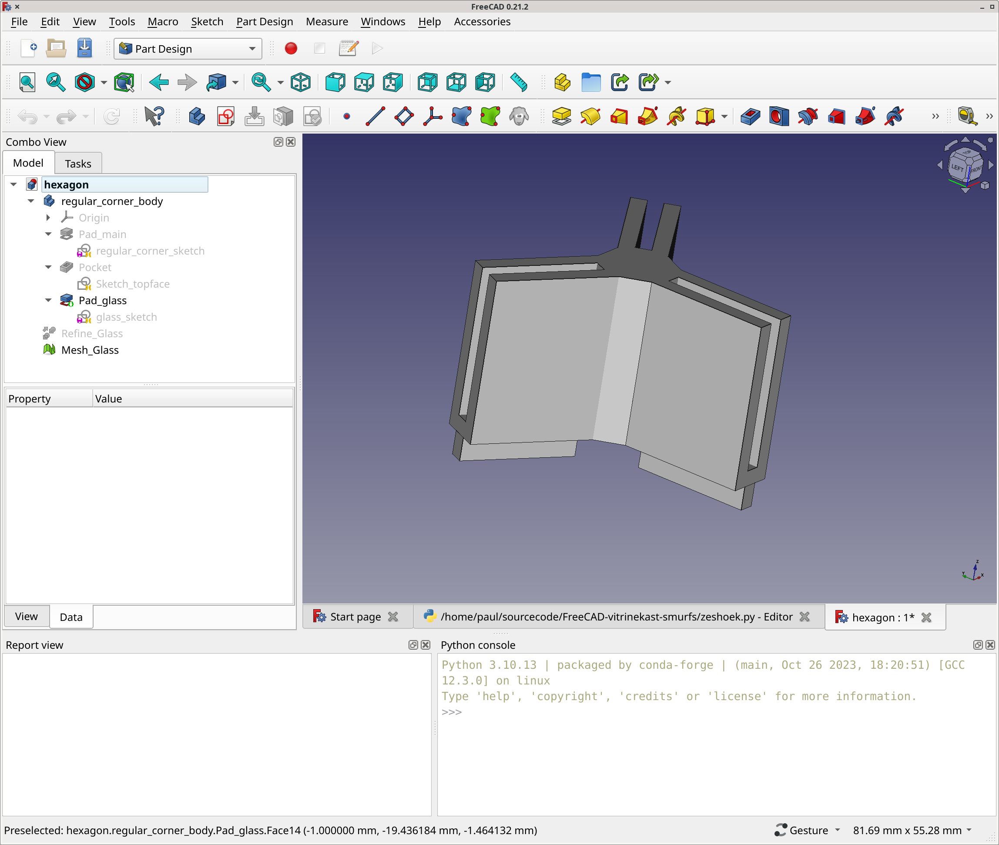
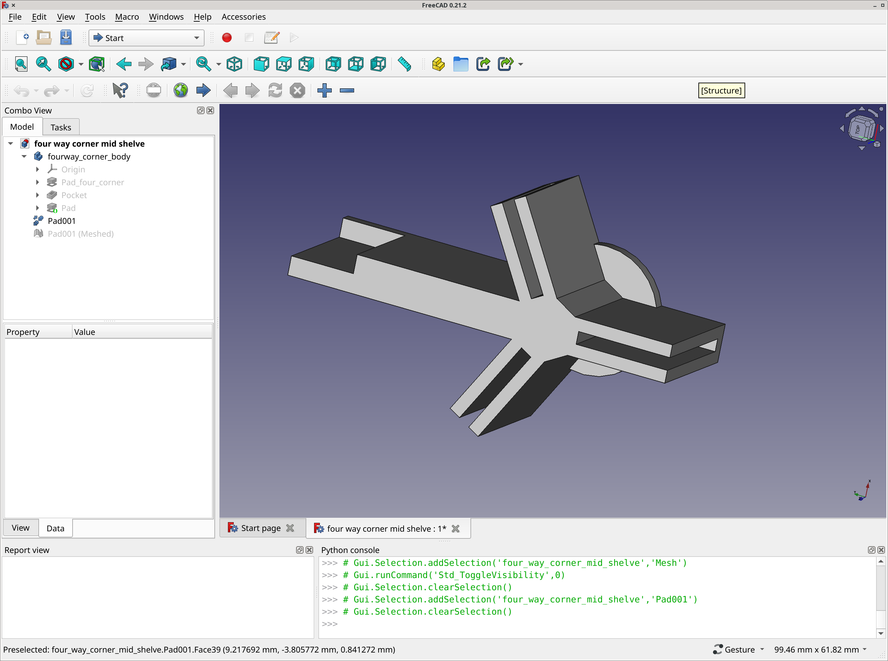
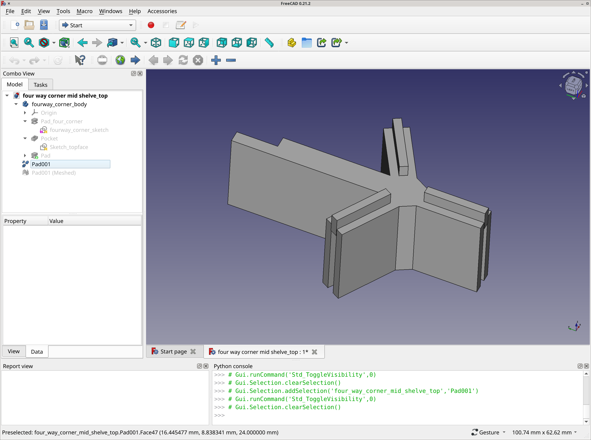
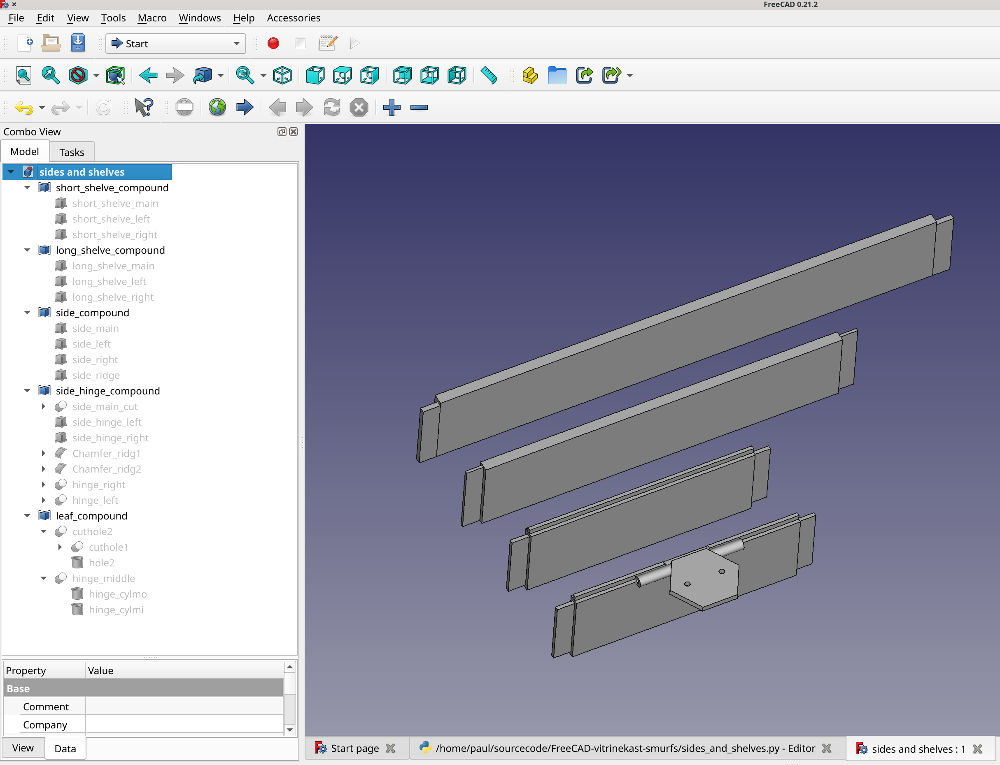

Wall display shelve thingy for small figurines like smurfs.
-----------------------------------------------------------

Hexagon shaped.

3D printed corner pieces:
There are two variants, each consisting of a top and bottom part.

1. the 3-way 'normal' to glue against the wall

2. the 3-way 'normal' to put on top of the glue part

3. the 4-way that supports a mid-shelve in the hexagon, to glue

4. the 4-way that supports a mid-shelve in the hexagon, on top

3D printed sides and shelves:
Screenshot shows the FreeCAD file generated by 'sides_and_shelves.py' both shelves and the side with and without hinges, including the hingeleaf that holds the plexiglass.

sides to do:
- sides with single shelve (mirror)
- sides with both shelves (mirror)

